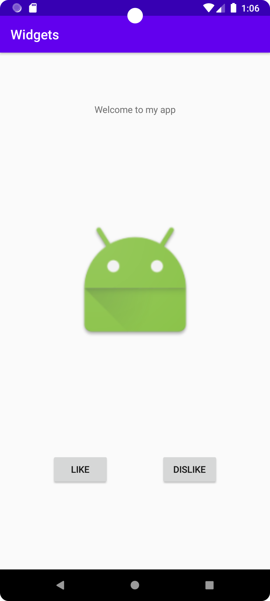

# Rapport

Jag valde ConstraintLayout som min layout för min app. Efter jag valde vilken layout jag ska använda så implemtenterade
jag en textview som hade som text "Welcome to my app". Jag ändra på textview position med hjälp av att anävnda mig 
av denna rad kod:

```
<TextView
    (...)
    app:layout_constraintVertical_bias="0.1"
    (...)/>
```

Efter jag gjorde det bestämde jag mig att implementera två knappar som den ena knappen har texten "Like"
och den andra knappen har texten "Dislike". Den ena knappen är mer åt vänster sidan och den andra är mer
på den högra sidan av appen. Men dessa två knappar är på samma nivå på horizentalt. På grund av att 
dessa knappar har olika position i vertikalt så behövdes det två det så att dessa två knappar har olika 
värden på sin position samt behöved det också en värde för vilken horizentalt nivå de ska ha.
Detta gjorde med två rader kod för att få en knapp att vara på rätt position. 

```
<Button
    (...)
    app:layout_constraintHorizontal_bias="0.1"
    app:layout_constraintVertical_bias="0.8"/>
```

Den andra knappen behöve bara den ena värdet som är vilken position den ska vara på vertikalr på grund av att
när jag satte knappens "start" constraint med den andra knappens "end" så var knappen på rätt horizentalt nivå.

Som sist implementerades det en imageview. Bilden är från själva android studio som man kunde välja mellan när
man la in en imageview i appen. Bilden position är i mitten av mellan textview och knapparna. Positionen ändrades
inte för den skulle vara i mitten av appen. Men för att få den mitten av appen gjordes det med hjälp av att 
sätta constrain mellan "start" på appen med "start" på bilden, mellan "end" på appen och "end" med bilden,
mellan "top" av bilden med "bottom" av texten och sist mellan "bottom" av bilden med "top" av den ena av knapparna.
Koden under visar hur det gjordes samt en rad kod som visar vart bilden är ifrån.

```
<ImageView
    (...)
    app:layout_constraintBottom_toTopOf="@+id/Button_Like"
    app:layout_constraintEnd_toEndOf="parent"
    app:layout_constraintStart_toStartOf="parent"
    app:layout_constraintTop_toBottomOf="@+id/Text_Welcome"
    app:srcCompat="@android:mipmap/sym_def_app_icon" />
```

Bilden under är då en bild av appen med texten, bilden och knapparna.


